# 📊 Adult Income Classification – Machine Learning Project


A machine learning project that predicts whether a person's income exceeds **$50K/year** based on demographic and employment data, using the **Adult Census Income Dataset**.

---

## 📑 Table of Contents

- [Overview](#-overview)
- [Dataset](#-dataset)
- [Workflow](#️-workflow)
- [Exploratory Data Analysis](#-exploratory-data-analysis)
- [Models](#-models)
- [Results & Comparison](#-results--comparison)
- [ROC Curve Comparison](#-roc-curve-comparison)
- [Tech Stack](#-tech-stack)
- [Project Structure](#-project-structure)
- [How to Run](#-how-to-run)
- [Key Takeaways](#-key-takeaways)

---

## 🔍 Overview

This project covers a full data science workflow — from data cleaning and preprocessing to training and evaluating multiple classification models — to predict whether an individual earns more or less than $50K per year.

## 📁 Dataset

**Adult Census Income Dataset** (`adult.csv`) — 32,561 records with 15 features including:

| Feature | Description |
|---|---|
| `age`, `education.num`, `hours.per.week` | Numerical attributes |
| `workclass`, `education`, `occupation`, `marital.status` | Categorical attributes |
| `capital.gain`, `capital.loss`, `fnlwgt` | Financial / weighting attributes |
| `income` | Target variable (`<=50K` / `>50K`) |

After removing duplicates and rows with missing/unknown (`?`) values, the cleaned dataset contains **30,139 rows**.

## ⚙️ Workflow

| Step | Technique |
|---|---|
| **Data Cleaning** | Removed duplicates, handled missing values and unknown entries (`?`) |
| **Categorical Encoding** | Converted text columns using `LabelEncoder` |
| **Correlation Analysis** | Used heatmaps to explore relationships between features and the income target |
| **Feature Scaling** | Applied `MinMaxScaler` to numerical columns |
| **Outlier Handling** | Used the IQR (Interquartile Range) method for capping/removal |
| **Model Training** | Random Forest, KNN (auto K selection), Decision Tree (GridSearchCV), Logistic Regression |
| **Model Evaluation** | Accuracy, Precision, Recall, F1-score, Confusion Matrix, ROC-AUC |

## 📈 Exploratory Data Analysis

**Correlation Heatmap** — relationships between all features:

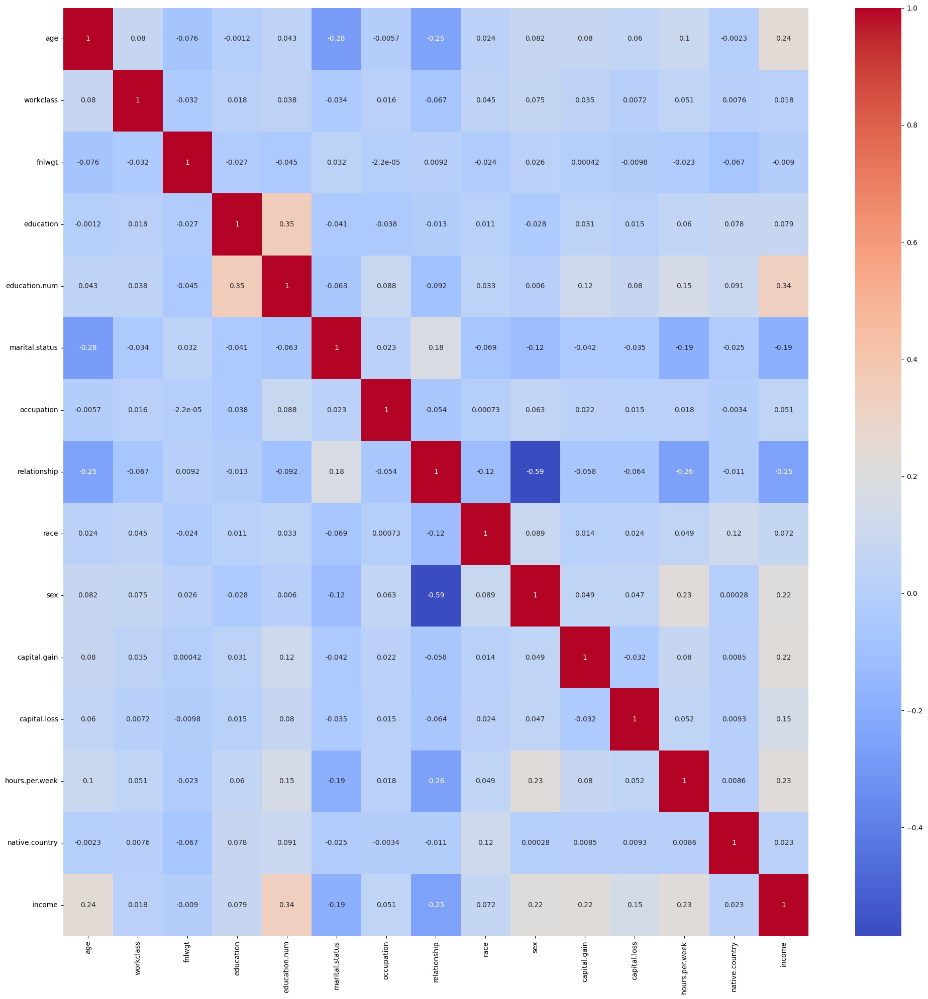

**Feature Correlation with Income** — which features matter most:

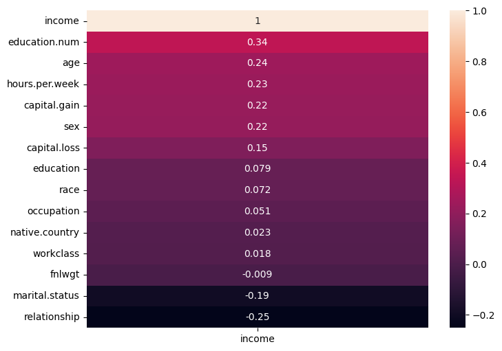

## 🤖 Models

Four classification models were trained and tuned:

1. **Decision Tree Classifier** — tuned with `GridSearchCV` (best: `entropy`, `max_depth=10`)
2. **K-Nearest Neighbors (KNN)** — automatic search for best K (best K = 11, `weights='distance'`)
3. **Logistic Regression** — tuned with `GridSearchCV` (best `C=10`)
4. **Random Forest Classifier** — 200 estimators, `max_depth=15`, `class_weight='balanced'`

## 🏆 Results & Comparison

| Model | Accuracy | Precision | Recall | F1-score | AUC |
|---|---|---|---|---|---|
| **KNN** | 0.8300 | 0.8249 | 0.8300 | 0.8269 | 0.8612 |
| **Random Forest** | 0.8174 | 0.8546 | 0.8174 | 0.8269 | **0.9124** |
| **Decision Tree** | 0.7880 | 0.8452 | 0.7880 | 0.8012 | 0.8891 |
| **Logistic Regression** | 0.7666 | 0.8118 | 0.7666 | 0.7795 | 0.8463 |

> 🥇 **KNN** achieved the highest overall accuracy, while **Random Forest** achieved the best AUC score (0.912), making it the most reliable model at distinguishing between income classes across all thresholds.

### Confusion Matrices

| Decision Tree | KNN |
|---|---|
| 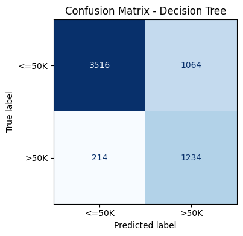 | 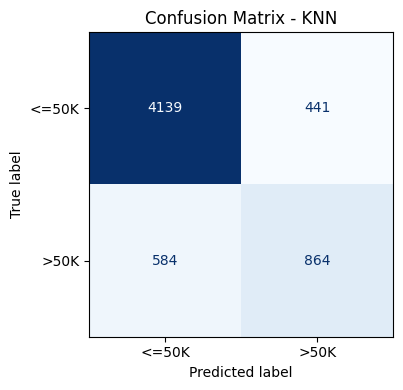 |

| Logistic Regression | Random Forest |
|---|---|
| 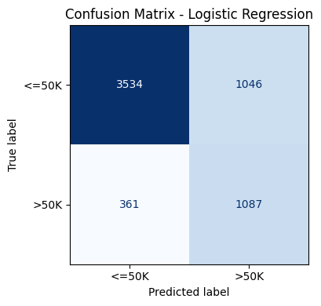 | 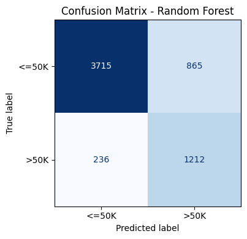 |

### Choosing the Best K for KNN

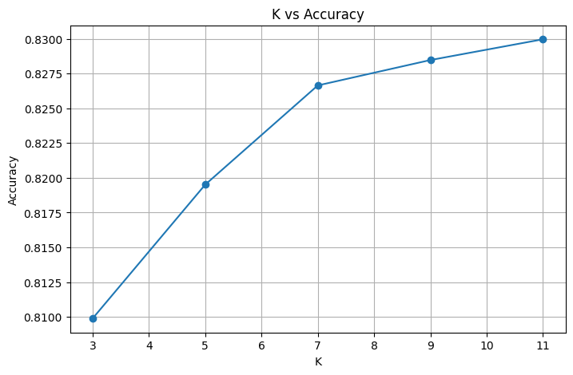

## 📉 ROC Curve Comparison

All four models compared on a single ROC plot:

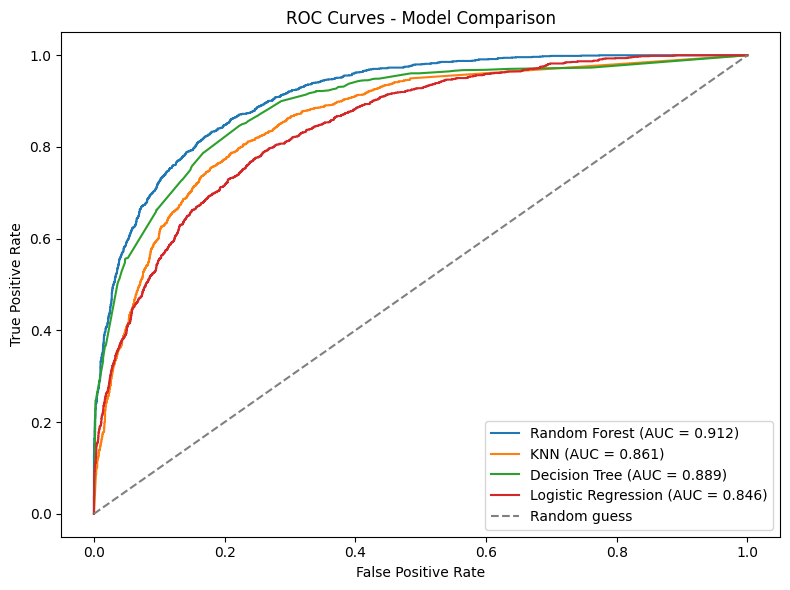

<details>
<summary>Individual ROC Curves</summary>

| Decision Tree | KNN |
|---|---|
| 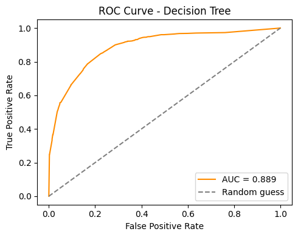 | 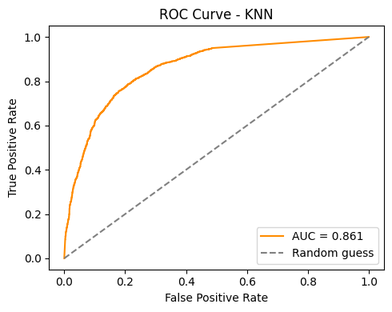 |

| Logistic Regression | Random Forest |
|---|---|
| 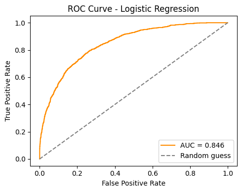 | 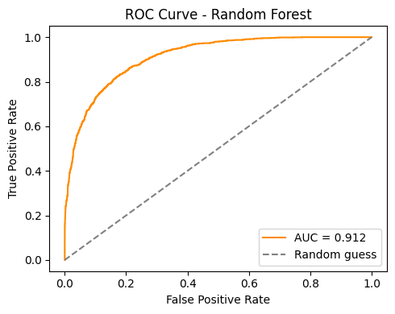 |

</details>

## 🧰 Tech Stack

`Python` · `Pandas` · `NumPy` · `Matplotlib` · `Seaborn` · `Scikit-learn`

## 📂 Project Structure

```
NTI_Project/
├── NTI_Project.ipynb     # Main notebook (EDA, preprocessing, modeling)
├── adult.csv              # Dataset
├── requirements.txt       # Python dependencies
├── *.png                  # Plots used in this README
├── LICENSE
└── README.md
```

## ▶️ How to Run

```bash
# Clone the repository
git clone https://github.com/<your-username>/<repo-name>.git
cd <repo-name>

# Install dependencies
pip install -r requirements.txt

# Launch the notebook
jupyter notebook NTI_Project.ipynb
```

## 💡 Key Takeaways

- Class imbalance (~76% `<=50K` vs ~24% `>50K`) was addressed using `class_weight='balanced'` in tree-based and linear models.
- **Random Forest** generalizes best (highest AUC), making it the recommended model for this task.
- **KNN** slightly edges out on raw accuracy but is more computationally expensive at inference time.
- Feature scaling and outlier handling had a noticeable positive effect on distance-based models like KNN.

---

⭐ If you found this project useful, consider giving it a star!
